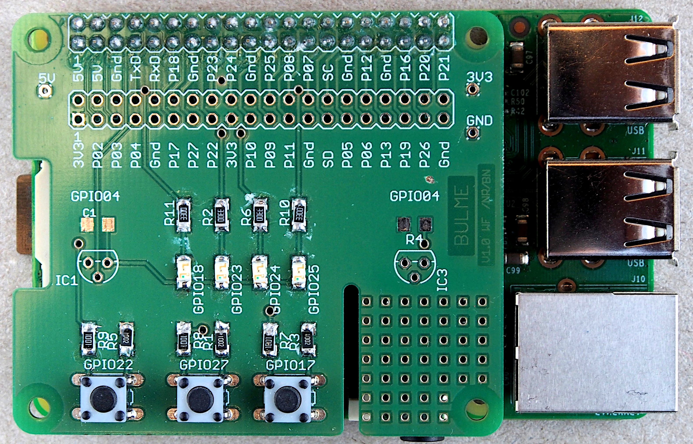

# GPIO pins ansprechen



#### Ansteuermethoden
- [Code Samples](https://elinux.org/RPi_GPIO_Code_Samples)
- [lgpio Bibliothek](http://abyz.me.uk/lg/lgpio.html) 

#### Installation von lgpio
Option 1: Bibliothek aus den offiziellen Quellen bauen:

- System aktualisieren: `sudo apt update && sudo apt upgrade -y`
- Zusätzlich benötigte Pakete installieren:  
`sudo apt install swig python-dev python3-dev python-setuptools python3-setuptools`
- Quelltext herunterlagen und installieren  
```
wget http://abyz.me.uk/lg/lg.zip
unzip lg.zip
cd lg
make
sudo make install
```

Option 2: Inoffizielles deb-Paket installieren (experimentell):

- [Download lg_20211118-1_armhf.deb](./files/lg_20211118-1_armhf.deb)
- Installieren: `sudo apt install ./lg_20211118-1_armhf.deb`
- Bibliothek dem System bekanntmachen: `sudo ldconfig`


#### blink.c 

```c
// Blink with lgpio
// build: gcc blink.c -o blink -Wall -llgpio

#include <stdio.h>
#include <lgpio.h>

#define OUT 18
#define TSLEEP 0.5 // seconds

int main(int argc, char *argv[])
{
    int h;
    int lFlags = 0; /* default line flags */

    h = lgGpiochipOpen(0); /* get a handle to the GPIO */
    lgGpioClaimOutput(h, lFlags, OUT, 0); /* initial level 0 */

    while (1)
    {
        lgGpioWrite(h, OUT, 1);
        lguSleep(TSLEEP); /* sleep for 0.1 seconds */
        lgGpioWrite(h, OUT, 0);
        lguSleep(TSLEEP); /* sleep for 0.1 seconds */
    }
}
```

