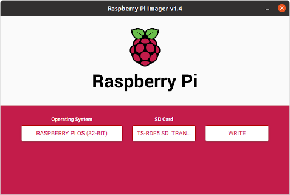

# Setup Raspberry

## Flashen der Micro-SD-Karte:



- Imager Download: <https://raspberrypi.org/software>
- SD-Karte in den Adapter stecken, Adapter in USB-Anschluss am PC stecken
- Imager am PC starten, Betriebssystem Raspi OS und SD-Karte auswählen, Schreibvorgang starten:
- Konfiguration für "Headless"-Betrieb (ohne extra Monitor und Tastatur, nur übers Netz):  
```Strg-Hochstelltaste-X``` liefert ein verstecktes Konfigurationsmenü. Die folgenden Einstellungen sollten gleich hier gemacht werden, damit der Raspberry sofort in der Klasse einsatzfähig ist:
    - Hostname: der eigene Familienname, in Kleinbuchstaben, ohne äöüß und Sonderzeichen
    - SSH aktivieren (anhaken)
    - Passwort für 'pi' (Default-Passwort "raspberry" ändern und __notieren__)
    - Wifi einrichten: SSID / Passwort / Wifi-Land: AT
    - Spracheinstellungen: Zeitzone Europe/Vienna, Tastaturlayout de


##  Raspberry Start und Login:

- Karte in den Slot am Raspberry stecken, Steckernetzteil und Ethernetkabel - falls kein WLAN vorhanden oder konfiguriert ist - mit dem Raspberry verbinden. Das Betriebssystem startet jetzt.
- Zur Terminalverbindung übers Netz gibt es zwei Optionen:
    1. Windows-Eingabeaufforderung ```ssh pi@meinraspi.local``` (Windows 10 und neuer)
    2. Putty downloaden <https://the.earth.li/~sgtatham/putty/latest/w64/putty.exe> und am PC installieren


_(Wenn die Namensauflösung mit ```raspberrypi.local``` nicht funktioniert, IP-Adresse mit einem Netzwerkscanner (z.B. ```fling``` am Handy) suchen und diese anstelle des Hostnamens in putty eingeben.)_

## Basiskonfiguration:
- Soweit das nicht schon beim Flashen erfolgt ist, können Hostname und Passwort des Users "pi" auch im laufenden Betrieb vom Terminalprogramm aus geändert werden:   
```sudo raspi-config``` eintippen (```sudo``` = do as a superuser). Unter ```System Options``` finden sich die passenden Einstellungen. Danach das Konnfigurationstool verlassen und Reboot wählen. _(Navigieren im Konfigurationstool funktioniert mit den Pfeiltasten und dem Tabulator.)_
- Remote Desktop aktivieren: Liste der installierbaren Softwarepakete aktualisieren und RDP-Server installieren - Terminal: ```sudo apt update && sudo apt install xrdp```  
_Wichtig! In der neuesten Version Raspberry Pi OS "bullseye" sind ein Upgrade und zwei zusätzliche Schritte notwendig, sonst zeigt die Remotedesktopverbindung nur einen leeren Bildschirm:_  
    1. ```sudo apt upgrade -y```
    2. ```sudo raspi-config``` 
        - System -> Boot / Auto Login -> Desktop "Desktop GUI, requiring user to login" 
        - Interface Options -> VNC -> "Would you like the VNC Server to be enabled?" -> Yes 


## Betriebssystem herunterfahren:
__Ganz wichtig! Am Ende der Sitzung vor dem Abstecken der Versorgung,
im Terminal, egal ob am grafischen Desktop oder in putty:__ 

```sudo shutdown -h now```


 


