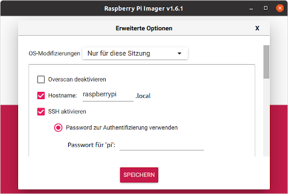

# Setup Raspberry

## Flashen der Micro-SD-Karte:


- Imager Download: <https://raspberrypi.org/software>
- SD-Karte in den Adapter stecken, Adapter in USB-Anschluss am PC stecken
- Imager am PC starten, Betriebssystem Raspi OS und SD-Karte auswählen, Schreibvorgang starten:
- Konfiguration für "Headless"-Betrieb (ohne extra Monitor und Tastatur, nur übers Netz): 
```Strg-Hochstelltaste-X``` liefert ein verstecktes Menu zur Netzwerkkonfiguration



- Nach Abschluss des Schreibvorganges den Adapter mit der Karte aus- und wieder anstecken. Unter Windows sollte die Karte jetzt als Wechseldatenträger eingehängt im Dateiexplorer sichtbar sein.

##  Raspberry Start und Login:

- Karte in den Slot am Raspberry stecken, Ethernetkabel und Steckernetzteil mit dem Raspberry verbinden. Raspberry startet jetzt.
- Putty downloaden <https://the.earth.li/~sgtatham/putty/latest/w64/putty.exe> und am PC installieren
- Einloggen via putty: Host: ```raspberrypi.local``` / User: ```pi``` / Passwort: ```raspberry```


- _Wenn die Namensauflösung mit ```raspberrypi.local``` nicht funktioniert, IP-Adresse mit einem Netzwerkscanner (z.B. ```fling``` am Handy) suchen und diese anstelle des Hostnamens in putty eingeben._

## Basiskonfiguration:
- Passwort des Users "pi" ändern: Im Terminal ```passwd``` eingeben, zunächst das alte Passwort ```raspberry```, dann zweimal das neue eingeben (die eingegebenen Buchstaben sind nicht sichtbar). __Bitte das neue Passwort notieren und zum Raspberry dazulegen!__
- Hostnamen ändern. Zur Arbeit speziell in der Klasse soll der Rechnername gleich dem Familiennamen sein. Beispiel: Fred Feuerstein -> ```feuerstein```. Dazu im Terminal ```sudo raspi-config``` eintippen (```sudo``` = do as a superuser). Unter ```Network Options``` zum Punkt ```Hostname``` gehen. Der Name soll klein geschrieben werden,  ohne Sonder- und Leerzeichen.  Danach das Konnfigurationstool verlassen und Reboot wählen. _Navigieren im Konfigurationstool funktioniert mit den Pfeiltasten und dem Tabulator._
- Remote Desktop aktivieren: Liste der installierbaren Softwarepakete aktualisieren und RDP-Server installieren - Terminal: ```sudo apt update && sudo apt install xrdp```  
_Wichtig! In der neuesten Version Raspberry Pi OS "bullseye" sind ein Upgrade und zwei zusätzliche Schritte notwendig, sonst zeigt die Remotedesktopverbindung nur einen leeren Bildschirm:_  
    1. ```sudo apt upgrade -y```
    2. ```sudo raspi-config``` 
        - System -> Boot / Auto Login -> Desktop "Desktop GUI, requiring user to login" 
        - Interface Options -> VNC -> "Would you like the VNC Server to be enabled?" -> Yes 


__Ganz wichtig! Vor dem Abstecken der Versorgung,
im Terminal, egal ob am grafischen Desktop oder in putty:__ 

```sudo shutdown -h now```


 


