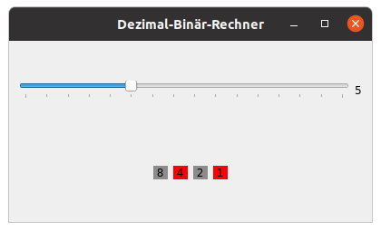
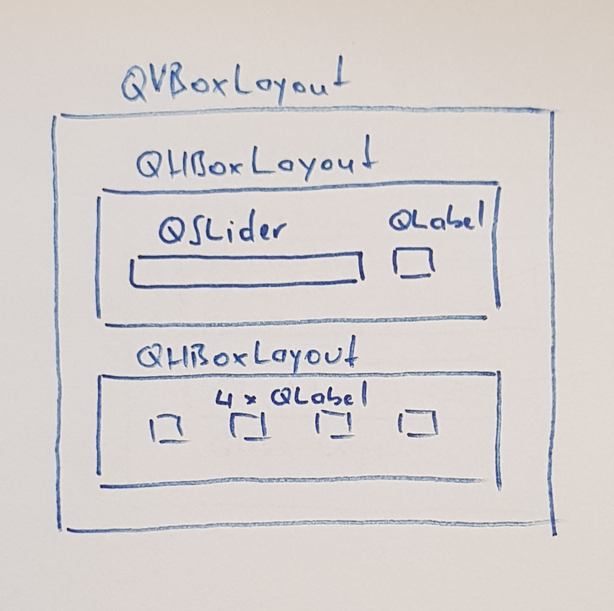

# Grafische Oberflächen mit Qt

## Installation
```sudo apt install python3-pyqt5* pyqt5-dev-tools```

## Programm "Hello"
```py
#!/usr/bin/env python3
import sys
from PyQt5 import QtCore, QtWidgets
from PyQt5.QtWidgets import QMainWindow, QLabel, QWidget, QApplication, QLineEdit, \
    QPushButton
from PyQt5.QtCore import QSize

class MyWindow(QWidget):
    def __init__(self):
        # Konstruktor von QWidget aufrufen
        super().__init__()

        # Fenstergröße und Titel einstellen
        self.setMinimumSize(QSize(300, 100))
        self.setWindowTitle('Greeting')

        # Beschriftung
        nameLabel = QLabel("Name:", self)
        nameLabel.move(20, 20)

        # Eingabefeld
        self.nameEntry = QLineEdit(self)
        self.nameEntry.move(80, 20)
        self.nameEntry.resize(200, 20)

        # Send Button
        sendbutton = QPushButton("Send", self)
        sendbutton.clicked.connect(self.greetMe)
        sendbutton.move(80, 60)
        sendbutton.resize(200, 20)

        # Ausgabe
        self.greetingLabel = QLabel(self)
        self.greetingLabel.move(80, 100)
        self.greetingLabel.resize(200, 20)

        # Widget anzeigen
        self.show()

    def greetMe(self):
        print(self.nameEntry.text())
        self.greetingLabel.setText("Hallo " + self.nameEntry.text() + "!")

# Game loop
app = QApplication(sys.argv)
win = MyWindow()
app.exec_()
```

## Übungsaufgabe Bit-Repräsentation mit Qt
### Grundgerüst
```py
#!/usr/bin/env python3
from PyQt5 import QtCore, QtWidgets
from PyQt5.QtWidgets import QMainWindow, QWidget, QVBoxLayout, QHBoxLayout, QLabel, QLCDNumber, QCheckBox
from PyQt5.QtCore import Qt, QSize, QTimer


# Klasse für das Hauptfenster
class MyWindow(QMainWindow):
    def __init__(self):

        # Konstruktor von QMainWindow aufrufen
        super().__init__()
        self.setMinimumSize(QSize(250, 120))    
        self.setWindowTitle('Bit Representation') 

        wid = QWidget(self)
        self.setCentralWidget(wid)

        vlayout = QVBoxLayout()
        wid.setLayout(vlayout)

        self.lcd_number = QLCDNumber(2, wid)
        vlayout.addWidget(self.lcd_number)

        hlayout = QHBoxLayout()
        vlayout.addLayout(hlayout)

        self.checkboxes = [QCheckBox(wid), QCheckBox(wid), QCheckBox(wid), QCheckBox(wid)]
        for index, cb in enumerate(self.checkboxes):
             hlayout.addWidget(cb)
             cb.clicked.connect(self.bin2dec)


    def bin2dec(self):
        value = 0
        for index, cb in enumerate(self.checkboxes):
            if cb.isChecked():
                value+=1
        self.lcd_number.display(value)


app = QtWidgets.QApplication([])
win = MyWindow()
win.show()
app.exec_()
```
### Aufgabe Teil 1
Vervollständige bitte das Grundgerüst, sodass die Binärzahl - repräsentiert durch die angehakten Checkboxen - in eine Dezimalzahl umgerechnet und im LCD angezeigt wird.

### Aufgabe Teil 2
Zeige die Binärzahl zusätzlich über die LEDs am Raspberry-Zusatzboard an. Verwende dazu die Library `gpiozero`.

## Übungsaufgabe Dezimal-Binär-Konverter
Mit einem `QSlider` wird eine Dezimalzahl von 0...15 eingestellt. Der aktuelle dezimale Wert wird neben dem Slider angezeigt. Die Visualisierung der zugehörigen Dualzahl erfolgt mittels `QLabel` (GUI) und LEDs (Zusatzboard).

_Tipp: Zur Farbänderung des Hintergrundes eines QLabel kann die Funktion `setStyleSheet("background-color: rgb(x, y, z)")` mit `x, y, z`  im Bereich 0...255 für die jeweilige Farbe verwendet werden._ 



_Empfohlener Lösungsansatz:_  



_Code zur Erstellung des Layouts:_

```py
# Slider + Label Anzeige Dezimalwert
self.slider = QSlider(Qt.Horizontal)
self.label = QLabel('0') 
sliderbox = QHBoxLayout()
sliderbox.addWidget(self.slider)
sliderbox.addWidget(self.label)

# Labels fuer 4 Bits
self.bitlabels = [] # Liste 
# hier bitlabels erstellen      
bitbox = QHBoxLayout()
for bitlabel in self.bitlabels:
    bitbox.addWidget(bitlabel)

# Layout zusammenbauen
vbox = QVBoxLayout()
vbox.addLayout(sliderbox)
vbox.addLayout(bitbox)

# vbox anzeigen in QWidget
self.setLayout(vbox)
```
_Variablen müssen nur dann als Membervariablen (`self`) bezeichnet werden, wenn sie in Funktionen außerhalb des Konstruktors ausgelesen oder verändert werden!

 [siehe Dokumentation](https://docs.python.org/3/tutorial/datastructures.html)_

_Bei Verwendung der Bibliothek `gpiozero` lässt sich eine Gruppe von LEDs sehr elegant als Liste ansteuern:_

`self.leds = LEDBoard(18, 23, 24, 25)`

[siehe Doku gpiozero](https://gpiozero.readthedocs.io/en/stable/recipes_advanced.html#ledboard)


